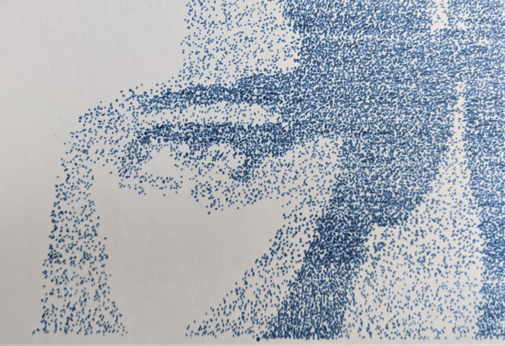

One of the more basic things you can do with a plotter is pointillism. That's the technique of creating an image out of tiny dots - the same mechanism screens use to display images, the dots being different coloured pixels. By varying the distance between the dots according to the brigthness of the underlying image, you can get a low resolution interpretation of it.

It sounds like a fun thing to try, but in the end I was left a little disappointed by my results. The main problem I had with is that the output just looks like the output from a poor inkjet printer, and doesn't have much of the characteristics of using a plotter in it. Sure, if you look closely you can see the variations in the dots (caused by the pen being at an angle or due to variations in the ink flow), but each dot is small and specific enough that it's a little boring.



Here's my basic workflow for this:


1. Load up an image, and starting at the top left, get the brightness informatio n for a pixel at (x, y).
    ```
        img = loadImage("Bjork_EB.jpg");
        int imageW = img.width;
        int imageH = img.height;
        y = (iteration+1)+int(random(1,4));
        x = x + step*int(random(1,3));
        color pix = img.get(x, y);
        float brightness = brightness(pix);
    ```
2. If the brightness is less than a cutoff value, either:
   1. If it's a very dark pixel, just draw the point, and choose a small step size for the next x coordinate.
        ```
          if (brightness < 50) {
            step = round(random(2, 3));
              drawPoint(x, y, delay);
          }
        ```
   2. If the pixel is near the middle of the image (bjork's face), draw the less dark pixels around 50% of the time to get some lighter shadows. Choose a "medium" step value for increasing x.
        ```
        else if (x< 0.6*imageW && x> 0.3*imageH) {
          if (random(0,1) > 0.5) {
            fill(0, 0, 200, 90);
              drawPoint(x, y, delay);
          }
          step = round(random(3, 6));
      }
        ```
    3. If the pixels are not in the middle, draw the pixel only 5% of the time, and choose a large step value so we can skip over empty parts.
        ```
         else {
          step = int(random(5, 15));
          if (random(0,1) > 0.95) {
            fill(0, 0, 200, 90);
            drawPoint(x, y, delay);
          }
         }
        ```
3. Choose a new point on the x-axis depending on the *step* value, and repeat until end of the row, and start again from a new y. Repeat until the whole picture is done.

I was hoping that by using such probabilistic rules, some of the characteristics of them would be remain visible in the final plot. As in, you would almost be able to almost deduce the rules by looking at the image, or your brain subconsciously could. I don't think it really worked, as the final image looks nice, but pretty ordinary.

I was surprised how easy it is to work with images in Processing though. I had avoided it until this, but it's not that bad!

Full code:
```

PImage img;

import processing.serial.*;

Serial myPort;    // Create object from Serial class
Plotter plotter;  // Create a plotter object
int val;          // Data received from the serial port
int lf = 10;      // ASCII linefeed

//Enable plotting?
boolean PLOTTING_ENABLED = true;
boolean draw_box = false;
boolean draw_label = true;
boolean up = true;

boolean just_draw = true;


//Label
String dateTime = day() + "/" + month() + "/" + year() + hour() + ":" + minute() + ":" + second() + " - ";
String label = dateTime + "POINTILLISATION OF BUTTERBJORK";

//Plotter dimensions
int xMin = 600;
int yMin = 800;
int xMax = 10300 - 300;
int yMax = 8400 - 600;
int A4_MAX_WIDTH = 10887;
int A4_MAX_HEIGHT = 8467;
int VERTICAL_CENTER = (xMax + xMin) /2;
int HORIZONTAL_CENTER = (yMax + yMin) /2;
int loops = 0;

int i = 0;
int lastY = yMin;
int cuttage = 355;

int x = 0;
int y = 0;
  int step = 5;
  int iteration = 6;

int xguide = x;
int yguide = y;

int mass = 50;

void setup() {
  size(840, 1080);
  smooth();


  img = loadImage("Bjork_EB.jpg");
  //image(originalImage, 0, 0);
  //img =  get(300, 0, 900, 700);
  imageMode(CENTER);
  stroke(0, 0, 200, 90);
  background(255);
  frameRate(999999);
      fill(0, 0, 200, 90);


  if (just_draw) {
    draw_box = false;
    draw_label = false;
    PLOTTING_ENABLED = true;
  }

  //Select a serial port
  println(Serial.list()); //Print all serial ports to the console
  String portName = Serial.list()[1]; //make sure you pick the right one
  println("Plotting to port: " + portName);

  //Open the port
  myPort = new Serial(this, portName, 9600);
  myPort.bufferUntil(lf);

  //Associate with a plotter object
  plotter = new Plotter(myPort);

  //Initialize plotter
  if (PLOTTING_ENABLED) {
  plotter.write("IN;"); // add Select Pen (SP1) command here when the pen change mechanism is fixed

  //Draw a label first (this is pretty cool to watch)

  if (draw_label) {
  int labelX = xMax + 300;
  int labelY = yMin;
  plotter.write("PU"+labelX+","+labelY+";"); //Position pen
  plotter.write("SI0.14,0.14;DI0,1;LB" + label + char(3)); //Draw label
  fill(50);
  float textX = map(labelX, 0, A4_MAX_HEIGHT, 0, width);
  float textY = map(labelY, 0, A4_MAX_WIDTH, 0, height);

  text(dateTime + label, textY, textX);
  //Wait 0.5 second per character while printing label
  println("drawing label");
  delay(label.length() * 500);
  println("label done");
  }
    plotter.write("PU"+0+","+0+";", 3000); //Position pen

  }

}

void draw() {
  int delay = 150;
  int imageW = img.width;
  int imageH = img.height;
  y = (iteration+1)+int(random(1,4));
  x = x + step*int(random(1,3));
  color pix = img.get(x, y);
  float brightness = brightness(pix);
  if (brightness < 175) {
    if (brightness < 50) {
      step = round(random(2, 3));
        drawPoint(x, y, delay);
    } else if (x< 0.6*imageW && x> 0.3*imageH) {
      if (random(0,1) > 0.5) {
      fill(0, 0, 200, 90);
        drawPoint(x, y, delay);
      }
      step = round(random(3, 6));
    } else {
      step = int(random(5, 15));
      if (random(0,1) > 0.95) {
              fill(0, 0, 200, 90);
              drawPoint(x, y, delay);

      }
    }


  }

  if (x > imageW - cuttage) {
    x = 0;
    iteration = iteration + 1;
    int _x = int(map(x, 0, 1600 - cuttage, xMin, xMax));
    int _y = int(map(y, 0, 1000, yMin, yMax));
    plotter.write("PU"+_x+","+_y+";"); //Position pen
    delay(5000);
  }
      if (y > imageH) {
            x = 0;

    plotter.write("PU"+xMin+","+yMin+";"); //Position pen
    delay(5000);
    iteration = 0;
    loops = 1;
    println("LARGER THENA Y");
    fill(0, 200, 0, 90);
  }
}

void drawLine(float x1, float y1, float x2, float y2, boolean up) {
  float _x1 = map(x1, 0, A4_MAX_HEIGHT, 0, width);
  float _y1 = map(y1, 0, A4_MAX_WIDTH, 0, height);

  float _x2 = map(x2, 0, A4_MAX_HEIGHT, 0, width);
  float _y2 = map(y2, 0, A4_MAX_WIDTH, 0, height);
  line(_y1, _x1, _y2, _x2);

  String pen = "PD";
  if (up) {
    pen="PU";
  }


  if (PLOTTING_ENABLED) {

    plotter.write(pen+x1+","+y1+";");
    plotter.write("PD"+x2+","+y2+";"); //75 ms delay

    delay(200);
  }
}

void drawPoint(int x, int y, int delayT) {
  if (loops < 1) {


  x = int(map(x, 0, 1600 - cuttage, xMin, xMax));
  y = int(map(y, 0, 1000, yMin, yMax));

  float _x = map(x, 0, A4_MAX_HEIGHT, 0, width);
  float _y = map(y, 0, A4_MAX_WIDTH, 0, height);


  point(_y, _x);
  ellipse(_y, _x, 1.5, 1.5);
  if (PLOTTING_ENABLED) {
    plotter.write("PU"+x+","+y+";"); //Position pen
    plotter.write("PD"+x+","+y+";"); //Position pen

    delay(delayT);
  }
  }
}


/*************************
 Simple plotter class
 *************************/

class Plotter {
  Serial port;

  Plotter(Serial _port) {
    port = _port;
  }

  void write(String hpgl) {
    if (PLOTTING_ENABLED) {
      port.write(hpgl);
    }
  }

  void write(String hpgl, int del) {
    if (PLOTTING_ENABLED) {
      port.write(hpgl);
      delay(del);
    }
  }
}
```